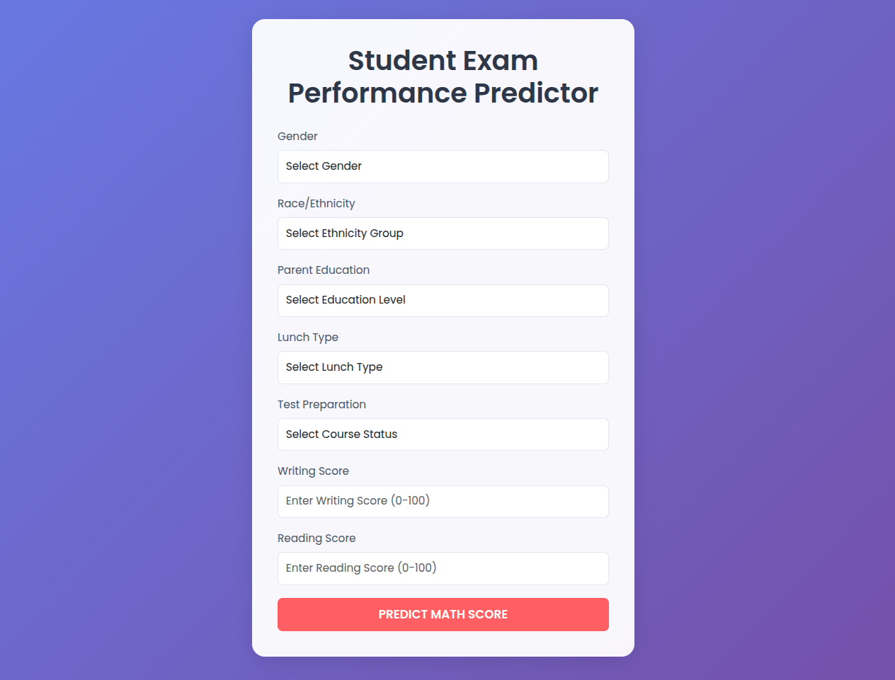

# End-to-End Student Performance Indicator

## Overview

This project is a machine learning web application built with Flask that processes input data, applies preprocessing, and makes predictions using a trained model. The project structure includes scripts for training, prediction, logging, and exception handling.

## Directory Structure

```
End-to-End Student Performance Indicator/
│-- artifacts/                # Stores trained models and preprocessors
│-- data/                     # Data files
│-- logs/                     # Log files
│-- notebook/                 # Jupyter notebooks for analysis
│-- src/
│   ├── components/           # ML components
│   ├── pipeline/             # Training and prediction pipelines
│   │   ├── predicting_pipeline.py
│   │   ├── training_pipeline.py
│   ├── exception.py          # Custom exception handling
│   ├── logger.py             # Logging module
│-- templates/                # HTML files for UI
│-- app.py                    # Main Flask application
│-- requirements.txt          # Required Python packages
│-- README.md                 # Documentation
│-- setup.py                  # Project setup script
│-- venv/                     # Virtual environment
```

## Installation

### Prerequisites

- Python 3.10+
- Virtual environment (venv or conda)

### Setup

1. **Clone the Repository:**
   ```bash
   git clone https://github.com/your-repo/end-to-end-student-performance-indicator.git
   cd end-to-end-student-performance-indicator
   ```
2. **Create and Activate Virtual Environment:**
   ```bash
   python3 -m venv venv
   source venv/bin/activate  # On Windows use: venv\Scripts\activate
   ```
3. **Install Dependencies:**
   ```bash
   pip install -r requirements.txt
   ```

## Usage

### Running the Web Application

To start the Flask server, run:

```bash
python app.py
```

The app will be available at `http://127.0.0.1:5000/`.

### Predicting Data

- The application accepts input in JSON format and processes it through `PredictPipeline`.
- The `CustomData` class is used to structure incoming data.
- Predictions are made using the trained model stored in the `artifacts/` directory.

### Training the Model

To retrain the model, run:

```bash
python src/pipeline/training_pipeline.py
```

## Debugging Issues

If you encounter `ValueError: Found unknown categories [None]`, ensure that:

- The input data does not have missing values.
- The `preprocessor.pkl` file is up to date.
- The `predict_pipeline.py` is correctly handling categorical encoding.

## Adding UI Image

To add an image of the UI:

1. Capture a screenshot of the web interface.
2. Save it in the `assets/` directory.
3. Link it in this README as follows:
   ```markdown
   
   ```

## License

This project is licensed under the MIT License.

